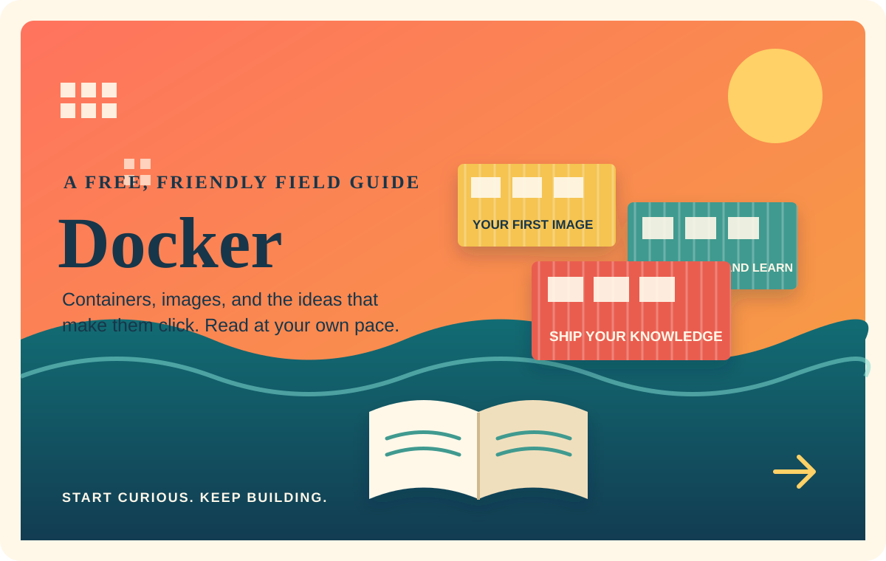

# Docker, One Step at a Time

### A free, friendly book for learning Docker

	

Welcome in. This is a book for anyone curious about Docker: start with the basics, build understanding one idea at a time, and read at whatever pace works for you. No paid course, special background, or hurry required.

## The idea

Docker can make software easier to build, share, and run, but its vocabulary can feel like a lot at first. This book is being shaped to make those ideas approachable with clear explanations and practical examples, so you can go from *"What is a container?"* to feeling at home with the tools.

Read freely, follow your curiosity, and come back whenever you need a refresher.

## A knowledge bundle

This repository is organized in the spirit of the [Open Knowledge Format (OKF)](https://github.com/GoogleCloudPlatform/knowledge-catalog/blob/main/okf/SPEC.md): knowledge is kept in portable, human-readable Markdown documents that can be explored without special software. OKF is the organizational inspiration for this Docker learning bundle.

## Start reading

Browse the Markdown materials in the repository and begin wherever your Docker questions begin. The goal is simple: make learning Docker open, understandable, and useful in the real world.