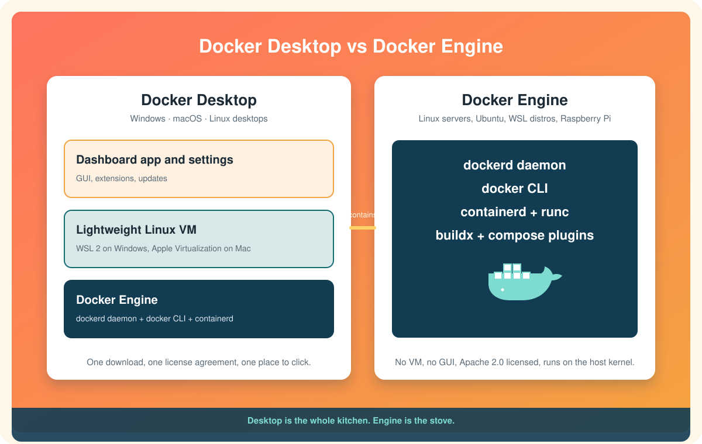

# Docker Desktop vs Docker Engine

Two products share the Docker name and people mix them up constantly. Here is the whole distinction in two sentences.

**Docker Engine** is the thing that actually runs containers: a background service called `dockerd`, the `docker` command that talks to it, and the low-level runtime underneath. It runs natively on Linux and only on Linux.[^engine-overview]

**Docker Desktop** is an application for Windows, macOS, and Linux desktops that bundles Docker Engine *plus* a lightweight Linux virtual machine to run it in, *plus* a graphical dashboard, settings, updates, and extensions.[^engine-overview]

  

Desktop is the whole kitchen. Engine is the stove. You cannot cook without the stove, and on Linux you can bolt the stove straight to the wall.

# Why the VM exists

Containers are a Linux kernel feature. They share the kernel of the machine they run on. Windows and macOS do not have a Linux kernel, so to run Linux containers there, *something* has to supply one. Docker Desktop's answer is a small, managed Linux VM: on Windows it is a WSL 2 distro named `docker-desktop`; on Mac it uses Apple's Virtualization framework.

That is why the Windows and Mac installers are large, why Docker Desktop has a Resources settings page for CPU and memory, and why "Engine running" appears in the status bar: the app is starting a VM and then starting Engine inside it.

On Ubuntu there is no gap to bridge. You install Engine directly and it uses the kernel you already have.

# What is in Docker Engine

| Piece | Job |
|---|---|
| `dockerd` | The daemon. Builds images, runs containers, manages networks and volumes. Listens on a Unix socket. |
| `docker` CLI | The command you type. It is just a client sending requests to the daemon. |
| `containerd` and `runc` | The lower-level runtime the daemon delegates to for actually creating container processes. |
| `docker buildx`, `docker compose` | Plugins, shipped as separate packages on Linux and bundled in Desktop. |

The client-daemon split matters. The `docker` command on your Windows machine can talk to a daemon inside WSL, or on a remote server, or in Desktop's VM. Same command, different target. Docker calls these targets *contexts*, and `docker context ls` shows which one you are using.

# What is in Docker Desktop

Everything above, inside a VM, plus:

* A **dashboard** to browse containers, images, volumes, and logs without memorizing commands.
* **Settings** for resources, file sharing, proxies, and on Windows the WSL integration toggles.
* **Automatic updates** of Engine, Compose, Buildx, and Kubernetes together.
* A built-in single-node **Kubernetes**, off by default.
* **Extensions** and a marketplace.

# Licensing, in plain terms

Docker Engine is open source under the Apache 2.0 license. Use it anywhere, for anything, for free.[^engine-overview]

Docker Desktop is free for personal use, education, open-source projects, and small businesses. If your employer has more than 250 employees **or** more than 10 million USD in annual revenue, commercial use of Docker Desktop requires a paid subscription.[^win-install] This is the single most common reason a company standardizes on "Engine inside WSL" instead of Desktop. See [Installing Docker on WSL](installing-docker-on-wsl.md) for that route.

# Which one do I have?

| You ran | You have |
|---|---|
| The Windows or Mac installer, or `winget`, or `brew install --cask docker-desktop` | Docker Desktop, with Engine inside its VM |
| `sudo apt install docker-ce ...` on Ubuntu or inside a WSL distro | Docker Engine, directly on that Linux |
| `sudo apt install ./docker-desktop-amd64.deb` on Ubuntu | Docker Desktop for Linux, which still runs its own VM and its own context[^desktop-ubuntu] |

If a whale icon lives in your system tray or menu bar, you have Desktop. If `systemctl status docker` answers, you have Engine on that machine.

# Which one should I pick?

* **New to Docker on Windows or Mac?** Desktop. One installer, a dashboard to look at, and nothing to configure.
* **On Ubuntu, a server, a Raspberry Pi, or CI?** Engine. It is smaller, faster to start, and has no VM in the way.
* **At a large company on Windows?** Check the licensing rule above. Engine inside WSL 2 is the free path and works well.
* **Need Windows containers?** Only Desktop with the Hyper-V backend does that.

Next: [Installing Docker on WSL](installing-docker-on-wsl.md)

[^engine-overview]: Docker Inc., Install Docker Engine.
[^win-install]: Docker Inc., Install Docker Desktop on Windows.
[^desktop-ubuntu]: Docker Inc., Install Docker Desktop on Ubuntu.
