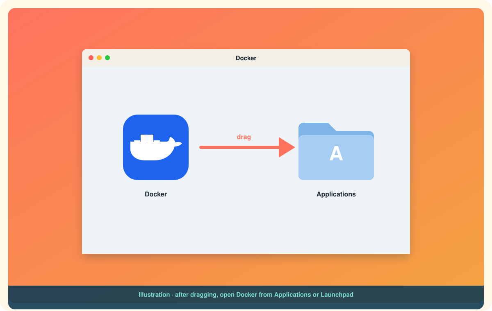

# Installing Docker on Mac

Like Windows, macOS has no Linux kernel, so "Docker on Mac" means **Docker Desktop**: an app that runs a small Linux virtual machine and puts Docker Engine inside it. Unlike Windows, there is no WSL step and nothing to enable in firmware. It is about as painless as installing any other Mac app.

If you want to know what that VM is doing there, read [Docker Desktop vs Docker Engine](docker-desktop-vs-docker-engine.md). It is three minutes well spent.

# Before you start

| Requirement | What to check |
|---|---|
| macOS version | The current release and the two before it. Docker drops support for older versions as Apple does.[^mac-install] |
| Chip | Apple silicon (M1 and newer) or Intel. Download the matching build; the installer will refuse the wrong one. Click the Apple menu, then **About This Mac**, to see which you have. |
| RAM | 4 GB minimum.[^mac-install] |
| Rosetta 2 | Apple silicon only, optional but recommended. Some older developer tools and `amd64` images need it. |

Install Rosetta on Apple silicon with:

```bash
softwareupdate --install-rosetta
```

# Three ways to install

## Way 1: the .dmg, drag and drop

1. Download **Docker.dmg** from [docker.com/products/docker-desktop](https://www.docker.com/products/docker-desktop/). Pick **Apple Silicon** or **Intel chip**.
2. Double-click the downloaded file to open it.
3. Drag the **Docker** whale onto the **Applications** folder.[^mac-install]
4. Open **Docker** from Applications or Launchpad.
5. macOS asks for your password once so Docker can install a helper. Accept the **Subscription Service Agreement**.

<p align="center">
  
</p>

Eject the disk image afterwards; you do not need it again.

## Way 2: Homebrew

If Homebrew is already part of your life, this is the tidy route. Note the cask is called **docker-desktop**; the old name, plain `docker`, was retired in 2025 and now refers to the CLI formula.[^brew-cask]

```bash
brew install --cask docker-desktop
```

Then open **Docker** from Applications once to finish setup and accept the agreement. Homebrew also handles upgrades: `brew upgrade --cask docker-desktop`.

## Way 3: the command line installer

For scripted setups or a machine you administer remotely. The `install` tool inside the .dmg does what the drag-and-drop does, plus initial configuration.[^mac-install]

```bash
sudo hdiutil attach Docker.dmg
sudo /Volumes/Docker/Docker.app/Contents/MacOS/install --accept-license --user=$USER
sudo hdiutil detach /Volumes/Docker
```

`--accept-license` skips the agreement dialog on first launch. `--user` runs the privileged setup for that user now, so they are not prompted for a password later.

# First launch

1. Open **Docker** from Applications. A whale appears in the menu bar at the top of the screen.
2. The whale animates while the VM boots. When it stops, the engine is running.
3. Click the whale and choose **Dashboard** if you want to look around. Sign-in is optional.

# Prove it works

Open **Terminal** and run:

```bash
docker --version
docker run hello-world
```

**Hello from Docker!** means the Mac client reached the daemon inside the VM, pulled an image, and ran it. Done.

## Apple silicon and the `amd64` question

Your Mac is `arm64`. Most popular images are published for both `arm64` and `amd64`, and Docker picks the right one automatically. When an image only exists for `amd64`, Docker Desktop will run it under emulation and print a platform warning. It works, slower. To ask for it explicitly:

```bash
docker run --platform linux/amd64 hello-world
```

Enabling Rosetta in **Settings, General, Use Rosetta for x86_64/amd64 emulation** makes those emulated containers noticeably faster.

# Common snags

**"Docker Desktop requires a newer macOS."** You are more than two major versions behind. Update macOS, or install an older Desktop release from Docker's release notes.

**Downloaded the wrong chip build.** The app will not launch. Delete it from Applications and grab the other one.

**`brew install --cask docker` installed the wrong thing.** Since 2025 that token is the CLI-only formula. Use `docker-desktop`.[^brew-cask]

**Password prompt every launch.** Run the command-line installer's `--user` step once, or in **Settings, Advanced** choose the system-wide install of the helper tools.

**Resource hungry.** Open **Settings, Resources** and lower the CPU and memory limits. The defaults are generous.

# What you have now

Docker Desktop on your Mac, a Linux VM you will rarely think about, Docker Engine inside it, and the `docker` command in Terminal. Every chapter from here on works the same on Mac, Windows, WSL, and Ubuntu.

Back to: [Getting started](index.md)

[^mac-install]: Docker Inc., Install Docker Desktop on Mac.
[^brew-cask]: Homebrew, cask docker-desktop; the former token was docker.
