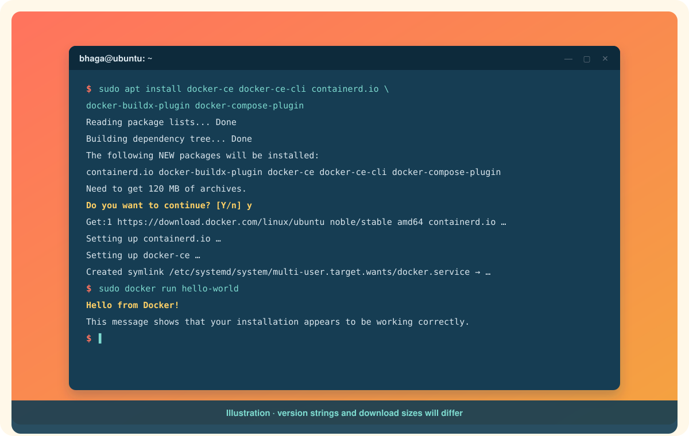

# Installing Docker on Ubuntu

Ubuntu is Docker's home turf. There is no virtual machine to set up and no desktop app to download. You add Docker's package repository, install **Docker Engine**, and you are running containers on the kernel you already have.

This page uses Docker's own apt repository rather than the `docker.io` package that ships with Ubuntu. Docker's repository gets new releases first, includes the Compose and Buildx plugins, and is what every other guide and error message assumes.[^engine-ubuntu]

Supported releases: Ubuntu 22.04 LTS (Jammy), 24.04 LTS (Noble), and 26.04 LTS (Resolute), on x86_64, arm64, armhf, s390x, and ppc64le.[^engine-ubuntu]

# Step 0: remove anything that might conflict

Ubuntu's archive carries older or unofficial packages with overlapping names. Clear them out first. It is harmless if none are installed.[^engine-ubuntu]

```bash
sudo apt remove $(dpkg --get-selections docker.io docker-compose docker-compose-v2 docker-doc docker-buildx podman-docker containerd runc | cut -f1)
```

Existing images and containers under `/var/lib/docker` are left alone.

# Step 1: add Docker's apt repository

Run these one block at a time. The first block installs prerequisites and fetches Docker's signing key.[^engine-ubuntu]

```bash
sudo apt update
sudo apt install ca-certificates curl
sudo install -m 0755 -d /etc/apt/keyrings
sudo curl -fsSL https://download.docker.com/linux/ubuntu/gpg -o /etc/apt/keyrings/docker.asc
sudo chmod a+r /etc/apt/keyrings/docker.asc
```

The second block writes the repository definition. It reads your Ubuntu codename and CPU architecture automatically, so it is safe to paste as-is.[^engine-ubuntu]

```bash
sudo tee /etc/apt/sources.list.d/docker.sources <<REPO
Types: deb
URIs: https://download.docker.com/linux/ubuntu
Suites: $(. /etc/os-release && echo "${UBUNTU_CODENAME:-$VERSION_CODENAME}")
Components: stable
Architectures: $(dpkg --print-architecture)
Signed-By: /etc/apt/keyrings/docker.asc
REPO

sudo apt update
```

If you are on an Ubuntu derivative such as Linux Mint or Pop!_OS, the codename lookup may fail. Replace the `Suites:` line with the Ubuntu codename your release is based on, for example `noble`.

# Step 2: install Docker Engine

```bash
sudo apt install docker-ce docker-ce-cli containerd.io docker-buildx-plugin docker-compose-plugin
```

<p align="center">
  
</p>

What you just installed:

| Package | Why |
|---|---|
| `docker-ce` | The daemon, `dockerd`. |
| `docker-ce-cli` | The `docker` command. |
| `containerd.io` | The runtime the daemon hands containers to. |
| `docker-buildx-plugin` | Modern `docker build`. |
| `docker-compose-plugin` | `docker compose` for multi-container apps. |

The service starts automatically. Check it:

```bash
sudo systemctl status docker --no-pager
```

# Step 3: prove it works

```bash
sudo docker run hello-world
```

**Hello from Docker!** means the client reached the daemon, the daemon pulled an image, created a container from it, and streamed its output back. That is Docker in one sentence.[^engine-ubuntu]

# Step 4: run docker without sudo

Typing `sudo` before every command gets old. The daemon's socket is owned by the `docker` group, so add yourself to it:[^postinstall]

```bash
sudo groupadd docker          # may already exist; that is fine
sudo usermod -aG docker $USER
newgrp docker                 # or log out and back in
docker run hello-world
```

Read this once and remember it: **membership in the `docker` group is equivalent to root** on this machine, because anyone who can talk to the daemon can mount the host filesystem into a container. On a personal laptop that is an acceptable trade. On a shared server, think twice.[^postinstall]

# Step 5: start on boot

On Ubuntu this is already the default, but it does not hurt to be explicit:[^postinstall]

```bash
sudo systemctl enable docker.service
sudo systemctl enable containerd.service
```

# The shortcut: Docker's convenience script

For a throwaway VM or a fresh cloud box, Docker publishes a script that does steps 0 through 2 for you:[^engine-ubuntu]

```bash
curl -fsSL https://get.docker.com -o get-docker.sh
sudo sh get-docker.sh
```

It is convenient and it is a script you downloaded from the internet and ran as root. Read it first on anything you care about. Steps 3 to 5 still apply afterwards.

# What about Docker Desktop for Linux?

There is also a Docker Desktop for Ubuntu, delivered as a `.deb`. It gives you the same dashboard and settings as Windows and Mac users get, and it runs Engine inside its own VM rather than directly on your kernel, so it needs KVM.[^desktop-ubuntu]

```bash
# after setting up the apt repository in step 1
sudo apt update
sudo apt install ./docker-desktop-amd64.deb
systemctl --user start docker-desktop
```

Desktop for Linux installs into its own Docker *context* so it does not fight with an Engine you installed above. `docker context ls` shows both and `docker context use default` switches back to native Engine.[^desktop-ubuntu] Most Ubuntu users never need Desktop. If you want the GUI, install it; if not, you are already finished.

# Common snags

**`E: Unable to locate package docker-ce`.** The `Suites:` line resolved to nothing. Check `cat /etc/apt/sources.list.d/docker.sources` and fix the codename, then `sudo apt update`.

**`permission denied while trying to connect to the Docker daemon socket`.** You skipped step 4, or have not logged out since. Run `newgrp docker` or open a new session.

**Inside WSL and the service will not start.** systemd is probably off in your distro. See the systemd wrinkle in [Installing Docker on WSL](installing-docker-on-wsl.md).

Next: [Installing Docker on Mac](installing-docker-on-mac.md)

[^engine-ubuntu]: Docker Inc., Install Docker Engine on Ubuntu.
[^postinstall]: Docker Inc., Linux post-installation steps for Docker Engine.
[^desktop-ubuntu]: Docker Inc., Install Docker Desktop on Ubuntu.
