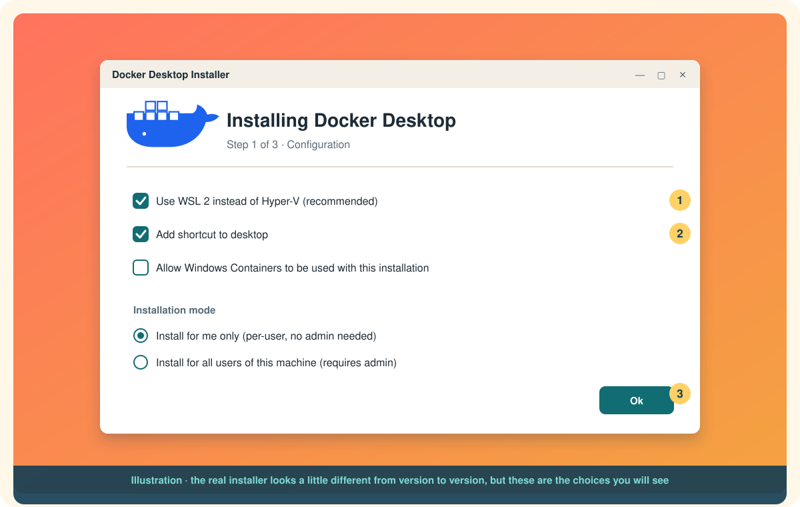
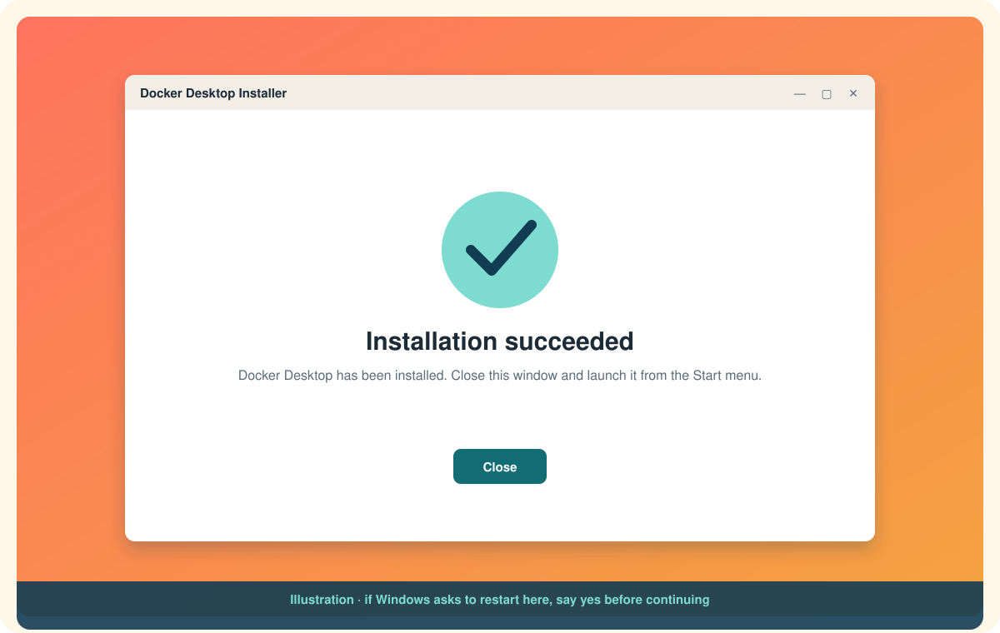
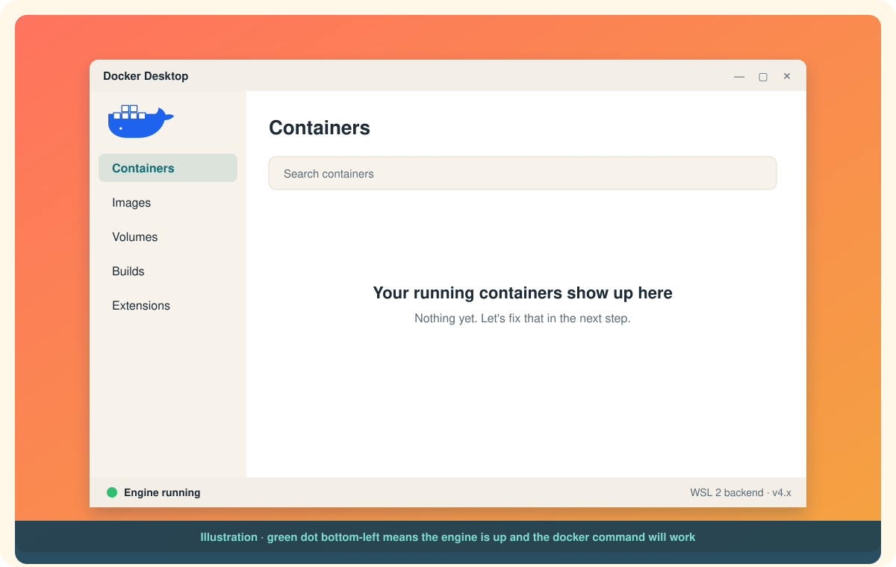

# Installing Docker on Windows

On Windows, "installing Docker" almost always means installing **Docker Desktop**. Docker Desktop is a Windows application that quietly runs a small Linux machine for you and puts Docker Engine inside it. You get a dashboard, a system-tray whale, and the `docker` command in PowerShell and in your WSL terminals, all from one installer.

If the phrase "Docker Engine inside a Linux machine" made you pause, read [Docker Desktop vs Docker Engine](docker-desktop-vs-docker-engine.md) after this page. It is short and it will make everything else click.

# Before you start

Check these four things. Each one is a common reason an install fails halfway.[^win-install]

| Requirement | What to check |
|---|---|
| Windows version | Windows 11 23H2 or newer, or Windows 10 22H2 (build 19045). Home, Pro, Enterprise, and Education all work for Linux containers. Windows Server is not supported. |
| Hardware | A 64-bit CPU with virtualization support, and virtualization enabled in BIOS/UEFI. 8 GB of RAM is the documented minimum. |
| WSL 2 | WSL version 2.1.5 or later. Docker Desktop can install it for you, but it is smoother if WSL already exists. See the next section. |
| Permissions | For the recommended per-user install you do not need to be an administrator. The all-users install does. |

To see your Windows version, press **Win + R**, type `winver`, press Enter.

## Get WSL 2 in place first

Docker Desktop's recommended backend is WSL 2, the Windows Subsystem for Linux. You will have a far smoother time if WSL is installed and up to date *before* you run the Docker installer.[^wsl-backend]

Open **PowerShell as Administrator** and run:

```powershell
wsl --install
```

That single command enables the required Windows features and installs Ubuntu as your default distro. Restart when it asks.[^ms-wsl] If WSL was already present, bring it up to date instead:

```powershell
wsl --update
wsl --version
```

Confirm your distro is on version 2:

```powershell
wsl --list --verbose
```

Anything showing `VERSION 1` can be converted with `wsl --set-version <Distro> 2`.

# Three ways to install

Pick one. They all end in the same place.

## Way 1: the installer, point and click

This is the path most people take.

1. Download **Docker Desktop Installer.exe** from [docker.com/products/docker-desktop](https://www.docker.com/products/docker-desktop/).
2. Double-click it. Windows may ask you to confirm.
3. On the **Configuration** page, keep **Use WSL 2 instead of Hyper-V** checked. Choose **Install for me only** unless you know you need an all-users install.
4. Wait for the files to unpack. It takes a few minutes.
5. Select **Close**. If the installer asks to restart, do it.

<p align="center">
  
</p>

<p align="center">
  
</p>

## Way 2: the installer, from the command line

Same file, no clicking. Useful for scripts and for people who like to see exactly what they are agreeing to.[^win-install]

Per-user install, no admin needed:

```powershell
Start-Process 'Docker Desktop Installer.exe' -Wait -ArgumentList 'install', '--user', '--accept-license'
```

All-users install, run from an elevated PowerShell:

```powershell
Start-Process 'Docker Desktop Installer.exe' -Wait -ArgumentList 'install', '--accept-license'
```

Flags worth knowing:

| Flag | Meaning |
|---|---|
| `--user` | Install for the current user only. Recommended. No admin needed for installs or updates. |
| `--accept-license` | Accept the Subscription Service Agreement now instead of at first launch. |
| `--backend=wsl-2` | Explicitly pick the backend. Also accepts `hyper-v`. WSL 2 is the default. |
| `--quiet` | Suppress installer output. |
| `--installation-dir=<path>` | Install somewhere other than Program Files. |

## Way 3: winget

If you use the Windows Package Manager, this is one line:

```powershell
winget install --id Docker.DockerDesktop -e
```

winget downloads the same installer and runs it for you. Watch for a prompt to accept the license and for a restart request at the end.

# First launch

1. Open the **Start** menu, type **Docker Desktop**, open it.
2. Accept the **Docker Subscription Service Agreement**. It is free for personal use, education, and small businesses. Companies over 250 employees or over 10 million USD in revenue need a paid subscription.[^win-install]
3. Sign in if you want to, or skip it. You do not need an account to run containers.
4. Wait for the status bar at the bottom-left to say **Engine running**.

<p align="center">
  
</p>

# Prove it works

Open PowerShell (a normal one is fine) and run:

```powershell
docker --version
docker run hello-world
```

The first command prints a version. The second pulls a tiny image and runs it. When you see **Hello from Docker!** followed by a short explanation of what just happened, you are done. That paragraph is worth reading once: it is the whole client-daemon-image-container story in four lines.

# If you installed for all users

Anyone besides the installing administrator needs to be in the **docker-users** group to use Docker Desktop:[^win-install]

```powershell
net localgroup docker-users <username> /add
```

Sign out and back in for it to take effect.

# Common snags

**"WSL 2 installation is incomplete" or "Virtualization not enabled."** Virtualization is turned off in your firmware. Reboot into BIOS/UEFI and enable Intel VT-x or AMD-V, then run `wsl --install` again.

**The installer wants Hyper-V.** You probably unchecked the WSL 2 box. Hyper-V works, but it needs an all-users install and admin rights, and it is only required for Windows containers. Re-run the installer and keep WSL 2.

**`docker` is not recognized in your WSL terminal.** That is a settings toggle, not a reinstall. Go to [Installing Docker on WSL](installing-docker-on-wsl.md).

**Per-user vs all-users regret.** You cannot switch modes in place. Uninstall and reinstall.

# What you have now

A Linux virtual machine managed by WSL 2, Docker Engine running inside it, and a Windows app and CLI that talk to it. The next page explains why that layering exists and why on Ubuntu you can skip the whole middle layer.

Next: [Docker Desktop vs Docker Engine](docker-desktop-vs-docker-engine.md)

[^win-install]: Docker Inc., Install Docker Desktop on Windows.
[^wsl-backend]: Docker Inc., Docker Desktop WSL 2 backend.
[^ms-wsl]: Microsoft, Install WSL.
