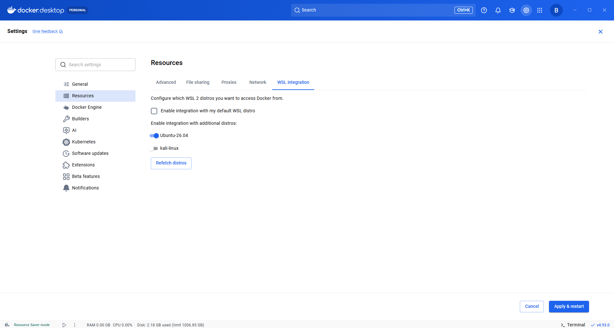
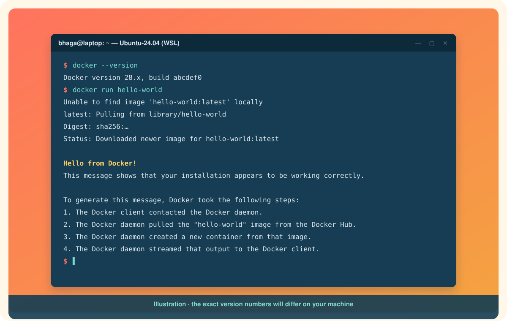

# Installing Docker on WSL

The Windows Subsystem for Linux gives you a real Ubuntu (or Debian, or Kali) terminal on Windows. Most developers who use Docker on Windows actually type their `docker` commands *there*, not in PowerShell, because their code, their shell scripts, and their habits are all Linux-shaped.

There are two ways to get `docker` working inside WSL. They are very different under the hood, so pick deliberately.

| Route | What runs where | Pick it when |
|---|---|---|
| **A. Docker Desktop with WSL integration** | Engine runs in Desktop's own hidden VM. Your distro gets a `docker` client wired to it. | You already installed Desktop, or you want the dashboard. |
| **B. Docker Engine inside the distro** | Engine runs natively in your Ubuntu distro. No Desktop at all. | You want the free, lightweight, server-like setup, or Desktop licensing rules you out. |

Do not do both in the same distro. You will end up with two daemons and confusing errors about sockets.

# Prerequisite for both routes: WSL 2 is installed

Neither route works until WSL itself is installed and running on version 2. Docker Desktop's WSL integration page can only list distros that already exist; if you have never installed a distro, the page will be empty and the toggles will have nothing to toggle.[^wsl-backend]

Open **PowerShell as Administrator**:

```powershell
wsl --install
```

This enables the Windows features and installs Ubuntu as your default distro. Restart when prompted, then open **Ubuntu** from the Start menu once so it can finish setting up and ask you for a Linux username and password.[^ms-wsl]

If WSL is already installed and you want a particular distro:

```powershell
wsl --list --online
wsl --install -d Ubuntu-26.04
```

Then verify everything is on WSL version 2:

```powershell
wsl --update
wsl --list --verbose
```

Every distro you plan to use with Docker must show `2` in the VERSION column. Convert any stragglers with `wsl --set-version <Distro> 2`.

# Route A: Docker Desktop with WSL integration

You need Docker Desktop installed first. If you do not have it yet, do [Installing Docker on Windows](installing-docker-on-windows.md) and come back.

## Step 1: make sure Desktop is using the WSL 2 engine

Open Docker Desktop, click the **gear icon** for Settings, and on the **General** tab confirm **Use the WSL 2 based engine** is checked. On a fresh install it is.[^wsl-backend]

## Step 2: turn on integration for your distro

Still in Settings, go to **Resources** and then the **WSL integration** tab.[^wsl-backend]

<p align="center">
  
</p>

You will see:

* **Enable integration with my default WSL distro**: a checkbox for whatever `wsl --set-default` points at.
* **Enable integration with additional distros**: one toggle per installed WSL 2 distro. In the screenshot above, Ubuntu-26.04 is on and kali-linux is off.
* **Refetch distros**: click this if you just installed a distro and it is not listed yet.

Toggle on each distro you want `docker` in, then click **Apply & restart**. Desktop restarts its engine and injects a `docker` client plus a socket into each enabled distro.

Only WSL **2** distros appear here. If a distro is missing, it is almost always on version 1, or WSL is not installed at all. Go back to the prerequisite section.

## Step 3: use it

Open your distro's terminal, or Windows Terminal with the Ubuntu tab:

```bash
docker --version
docker run hello-world
```

<p align="center">
  
</p>

No `sudo` is needed. The `docker` binary in your distro is a thin client; the real work happens in Desktop's VM.

## Where to keep your code

Keep project files inside the Linux filesystem, for example under `~/projects`, not under `/mnt/c/...`. Bind mounts and file watching are dramatically faster from the Linux side.[^wsl-backend] Open that folder from Windows Explorer at `\\wsl.localhost\Ubuntu-26.04\home\<you>\projects` when you need to.

# Route B: Docker Engine directly inside the distro

This treats your Ubuntu distro like an Ubuntu server. No Desktop, no dashboard, nothing to license. Everything below runs *inside* the WSL terminal.

The install commands are exactly the Ubuntu ones, so follow [Installing Docker on Ubuntu](installing-docker-on-ubuntu.md) start to finish, then return here for the two WSL-specific wrinkles.[^engine-ubuntu]

## Wrinkle 1: make sure systemd is on

Docker Engine is started by systemd. Modern WSL enables systemd by default, but check:

```bash
cat /etc/wsl.conf
```

You want to see:

```ini
[boot]
systemd=true
```

If it is missing, add it with `sudo nano /etc/wsl.conf`, then from PowerShell run `wsl --shutdown` and reopen your distro.

## Wrinkle 2: start the service and verify

```bash
sudo systemctl enable --now docker
sudo usermod -aG docker $USER
newgrp docker
docker run hello-world
```

The `usermod` line lets you run `docker` without `sudo`. Note that membership in the `docker` group is effectively root on that distro.[^postinstall]

# Switching between routes later

If you installed Engine in a distro and later turn on Desktop's integration for that same distro, Desktop will warn you about a conflicting installation. Resolve it by either turning the integration off for that distro, or removing Engine from it with `sudo apt remove docker-ce docker-ce-cli containerd.io`.

# Common snags

**Toggles are greyed out or the list is empty.** WSL is not installed, or no distro is on version 2. See the prerequisite section, then click **Refetch distros**.

**`Cannot connect to the Docker daemon at unix:///var/run/docker.sock`.** On route A, Desktop is not running or integration is off for this distro. On route B, the service is not started: `sudo systemctl start docker`.

**`docker` works in PowerShell but not in Ubuntu.** Route A, step 2 was skipped. Enable the toggle for that distro.

**Everything is slow.** Your project is under `/mnt/c`. Move it into the Linux filesystem.

Next: [Installing Docker on Ubuntu](installing-docker-on-ubuntu.md)

[^wsl-backend]: Docker Inc., Docker Desktop WSL 2 backend.
[^ms-wsl]: Microsoft, Install WSL.
[^engine-ubuntu]: Docker Inc., Install Docker Engine on Ubuntu.
[^postinstall]: Docker Inc., Linux post-installation steps for Docker Engine.
