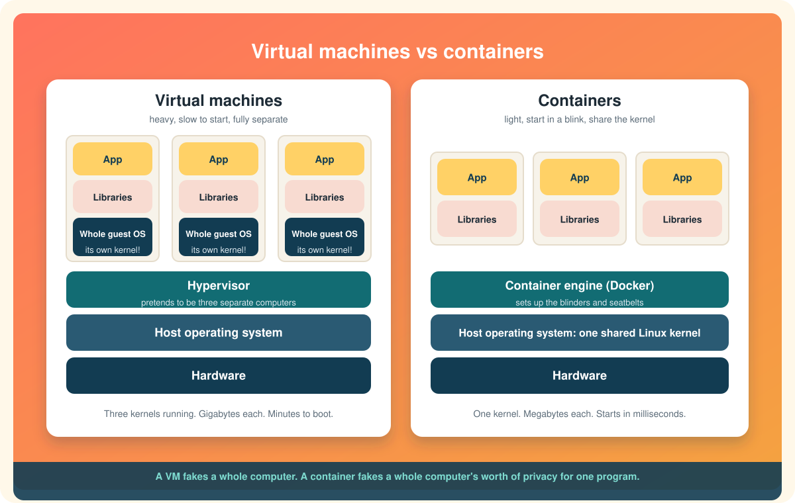

# Containers vs virtual machines

Both of these put a program in a box so it cannot bother the rest of the machine. People mix them up constantly, and for a good reason: from the inside, they feel similar. You log in, you see a Linux prompt, you have your own files and your own IP address.

The difference is entirely about *how much is being faked*.

  

# A virtual machine fakes the computer

A **virtual machine** (VM) is a pretend computer. A piece of software called a **hypervisor** sits on the real hardware and carves out imaginary ones: an imaginary processor, imaginary memory, an imaginary disk, an imaginary network card. Into that imaginary computer you install a complete operating system, kernel and all, exactly as you would onto a new laptop. That is the **guest** OS. The real machine's OS is the **host**.

The guest OS has no idea it is imaginary. It boots, it loads drivers for hardware that does not exist, it runs its own kernel, it manages its own memory. When the guest asks "its" processor to do something, the hypervisor quietly translates that into work on the real processor.

This is a tremendous trick, and it is the backbone of the entire cloud. Every "server" you rent from a cloud provider is a VM on a very large physical machine shared with strangers.

But look at what it costs. Three VMs means three full operating systems, three kernels, three sets of drivers, three copies of every system file, each one booting for a minute or more and each one eating a chunk of memory before your program has even started.

# A container fakes the view

A **container**, as the [previous page](what-is-a-container.md) explained, is a normal process on the host that has been given blinders (namespaces) and a seatbelt (cgroups). There is no imaginary processor. There is no guest kernel. The container's program makes requests directly to the real host kernel, the same way every other program on the machine does. The kernel just answers with an edited view.

Three containers means three processes. They share the one kernel that is already running. Starting one is starting a program: milliseconds. Each one carries only its own files, and even those are shared between containers wherever they are identical.

# The comparison, honestly

| | Virtual machine | Container |
|---|---|---|
| What is faked | An entire computer | One program's view of the computer |
| Operating system inside | Full guest OS with its own kernel | None. Uses the host kernel |
| Typical size | Gigabytes | Megabytes |
| Start time | Seconds to minutes | Milliseconds |
| How many fit on one machine | A handful to dozens | Hundreds to thousands |
| Isolation strength | Very strong, enforced by hardware | Good, enforced by the kernel |
| Can run a different OS | Yes. Windows on Linux, Linux on Mac | No. Linux containers need a Linux kernel |
| What you ship | A disk image of a whole OS | An image of one app and its files |

The line that surprises people is the second-to-last. A container shares the host's kernel, so a Linux container can only run on a Linux kernel. There is no way around it. Which raises an obvious question.

# So how does Docker run on my Mac or Windows laptop?

With a VM. Docker Desktop on Windows and macOS quietly runs one small Linux virtual machine, and your containers run inside *that*. On Windows the VM is a WSL 2 distribution. On a Mac it uses Apple's built-in virtualization.[^engine-overview]

That is the whole answer to "which is it, a container or a VM?" on a laptop: both. One VM to supply a Linux kernel, and then as many containers as you like sharing it. It is also why Docker Desktop has a settings page for how much memory to give "Docker": you are sizing that VM. On a real Ubuntu machine there is no VM at all, and [Docker Desktop vs Docker Engine](../getting-started/docker-desktop-vs-docker-engine.md) explains that difference.

# When you still want a VM

Containers did not kill virtual machines, and they were never going to. Choose a VM when:

* **You need a different kernel.** Windows programs on a Linux host, an old Linux kernel for an old program, a BSD, anything that is not "Linux, the same kernel as the host."
* **The isolation has to be bulletproof.** Multi-tenant clouds run strangers' code side by side. A kernel bug that lets a container escape its namespace is a real risk. A hypervisor boundary is much harder to cross. This is why cloud providers wrap each customer in a VM first and let them run containers inside.
* **The program expects to own the machine.** Some software wants to load kernel modules, manage its own hardware, or run a full init system. That is a VM's job.
* **You are running something for years, not minutes.** A database server that will run untouched for a long time is comfortable in a VM. Containers can do this, but their strengths lie elsewhere.

# When you want a container

* **You are shipping an application.** Package it once with all its libraries and run that exact thing on every laptop, test server, and production machine.
* **You want to start and stop things constantly.** Tests, builds, short jobs, scaling a web service up and down with traffic. Millisecond starts change what is practical.
* **You want many small things on one machine.** A dozen services on a laptop, each in its own box, without a dozen operating systems eating your memory.
* **You want reproducibility.** The image is the environment. Rebuild it and you get the same files, every time.

# The two together

In practice, almost everything runs as containers *inside* VMs. The VM gives the strong boundary and the choice of kernel. The container gives the fast, small, shippable unit of software. Kubernetes clusters are VMs full of containers. Your laptop with Docker Desktop is a VM full of containers. The question is rarely "which one" and more often "how big should each layer be."

# One sentence to keep

A VM fakes a whole computer so it can run a whole operating system. A container fakes just enough that one program thinks it is alone.

Next: [Types of containers](types-of-containers.md)

[^docker-overview]: Docker Inc., What is Docker?
[^engine-overview]: Docker Inc., Install Docker Engine.
