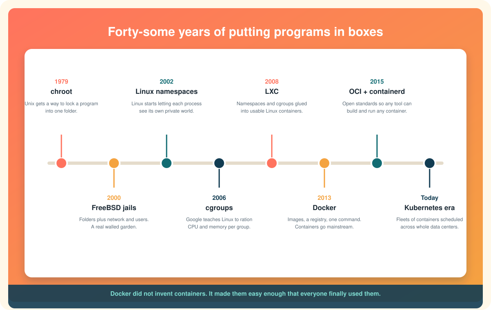

# The history and evolution of containers

Docker appeared in 2013 and within two years every conference, job posting, and startup pitch was about containers. It looked like an overnight invention. It was not. Docker was the last step in a forty-year walk, and every earlier step is still visible inside the containers you run today.

This page tells that story. Along the way it explains the Linux pieces by name, because once you know *why* each one was built, the names stop being jargon and start being history.

  

# 1979: chroot, the first wall

The story starts before Linux existed, in the Unix operating system at Bell Labs. In 1979, Unix version 7 gained a small command called **chroot**, short for "change root."[^chroot-man]

To understand it, picture how a Unix or Linux computer organizes files. Everything lives in one big tree that starts at a single folder called the **root**, written as `/`. Inside root are folders like `/home` for people's files, `/bin` for programs, `/etc` for settings. Every file on the computer has an address that starts at `/`.

What `chroot` did was tell one program, "from now on, *this* folder is your `/`." Pick a folder, say `/jail`, run a program with chroot pointed at it, and that program believes `/jail` is the top of the tree. It cannot name, let alone open, anything outside, because from where it stands there *is* no outside.

It was a modest tool, originally for testing software installs in a clean folder. But it planted the idea that would grow into everything else: **you can lie to a program about what the computer looks like, and the program will believe you.**

It also had a glaring gap. chroot only edited the program's view of *files*. The program could still see every other process on the machine, use the whole network, and eat all the memory. One wall, three open sides.

# 2000: FreeBSD jails, the first real room

For twenty years that was it. Then in 2000, the FreeBSD operating system (a Unix cousin, not Linux) shipped **jails**.[^jails]

A jail took chroot's locked folder and added the missing walls. A jailed program got its own IP address, so it could run a web server without colliding with the host's. It got its own set of users, so "root" inside the jail was not root outside. It could not see processes in other jails. Hosting companies loved it: one physical server could be sliced into many jails, each sold to a different customer who felt like they had their own machine.

Four years later, Sun Microsystems built something similar and more polished into Solaris, called **Zones**. Both are what [the previous page](types-of-containers.md) called system containers: whole little servers, long-lived, tended by hand.

Linux, meanwhile, had nothing of the kind. It was about to get there, but in pieces, over a decade, with no plan.

# 2002 to 2013: Linux builds the parts, one at a time

Linux never got a single "jails" feature. Instead, different people solved different pieces of the problem for their own reasons, and the pieces turned out to fit together.

## Namespaces: blinders, one sense at a time

In 2002, Linux added the first **namespace**: the mount namespace, which gave a process its own private view of what disks and folders were attached where. It was a generalization of chroot.[^namespaces-man]

Then, slowly, more kinds arrived. A UTS namespace (2006) let a process have its own hostname. A PID namespace (2008) gave it its own list of processes, with itself as number 1. A network namespace (2008) gave it its own network cards, addresses, and ports. A user namespace (2013) let it have its own idea of who root is.

Each one edits a process's view of one part of the system. Put a process in all of them and it is wearing full blinders: it sees a whole computer that contains only itself. The word "namespace" just means "a private set of names," and that is literally what each one provides: a private set of file names, process numbers, network names, user names.

## cgroups: the budget

Blinders were not enough, because a blinded process can still hog. In 2006, engineers at Google, who were running enormous numbers of jobs on shared machines and needed to stop one job from starving another, contributed a feature they first called "process containers." It was renamed **control groups**, or **cgroups**, and merged into Linux in 2008.[^cgroups-man]

A cgroup is a bucket you put processes in, with a budget attached: this much memory, this much processor time, this much disk and network bandwidth. The kernel enforces the budget. Blow the memory limit and the kernel kills the process, and nothing else on the machine notices.

Google used this internally in a system called Borg to pack thousands of jobs onto its servers. That experience would later become Kubernetes.

## LXC: gluing the parts together

By 2008, Linux had namespaces for blinders and cgroups for budgets, but using them meant writing low-level code against the kernel. **LXC**, Linux Containers, arrived that year as the first friendly tool to do the gluing: create the namespaces, set up the cgroup, drop a Linux filesystem in place, start the process.[^lxc]

LXC worked, and it is still maintained today. But it inherited the jails mindset: it made system containers, little long-lived machines you logged into and looked after. It was a cheaper VM, not a new way to ship software. It was powerful and it stayed niche.

# 2013: Docker changes the question

Docker started life inside a small company called dotCloud, which ran a platform-as-a-service and needed a good way to run customers' apps. In March 2013 they open-sourced the internal tool. It used LXC under the hood at first. Technically, there was almost nothing new in it.

What was new was the *question* it answered. Everyone before had asked "how do I slice one machine into many little machines?" Docker asked "**how do I package one program so it runs the same everywhere?**" And it answered with three ideas that are still the heart of every container tool:

**The image.** A read-only snapshot of a filesystem containing a program and everything it needs, built in layers so that common parts are shared. Not a disk image of an operating system. A package for *one app*.

**The Dockerfile.** A short text recipe for building that image, that you keep in your code repository next to the program it packages. Anyone can read it, rebuild it, and get the same result.

**The registry.** A place to push images and pull them from, by name. Docker Hub was to images what GitHub was to code. `docker pull nginx` and you have a web server.

Suddenly a container was not a little server to tend. It was a shippable unit of software, built from a recipe, fetched by name, started in milliseconds, thrown away when done. Developers who had never heard of namespaces or cgroups and did not want to hear about them could type one command and have a database running. The pieces Linux had spent a decade building finally had a reason to be used by everyone.

Within a year Docker had replaced LXC with its own library, libcontainer, talking straight to the kernel. Within two, every cloud provider supported it.

# 2015: standards, so nobody owns the idea

Docker's speed scared people, including Docker's own partners. If one company controlled the image format and the runtime, everyone building on containers was at its mercy.

In June 2015 Docker and a large group of companies founded the **Open Container Initiative** (OCI) under the Linux Foundation and donated the core pieces to it.[^oci] The OCI published two specifications: what an image *is*, byte for byte, and what a runtime must do to start a container from one. Docker's low-level runtime became **runc**, the reference implementation, owned by nobody.

Docker also split out its mid-level engine as **containerd**, and donated that too. This is why today an image built by Docker runs under Podman, why Kubernetes can run containers with no Docker installed at all, and why you can swap in gVisor or Kata underneath without changing your images. The parts became interchangeable. "Container" stopped meaning "Docker" and went back to meaning the idea.

# 2014 onward: Kubernetes and the age of fleets

One container on one machine is useful. A company runs thousands across hundreds of machines, and now the hard problem shifts: which container goes where, what happens when a machine dies, how does traffic find the right copies, how do you roll out a new version without downtime.

Google had been solving this internally with Borg for a decade. In 2014 it released an open-source rethinking of those ideas called **Kubernetes**, and in 2015 handed it to the newly formed Cloud Native Computing Foundation.[^k8s] Kubernetes does not make containers. It *schedules* them: you describe how many copies of what you want running, and it finds room, starts them, watches them, replaces them when they fail, and reshuffles when machines come and go.

Kubernetes won the orchestration race by around 2017 and became the standard way to run containers at scale. It is also why the OCI standards mattered so much: Kubernetes talks to containerd, CRI-O, or any other compliant runtime, and never needs to know whose tool built the image.

# The pattern in the story

Look back at the timeline and the same shape repeats.

1. **Someone solves a narrow problem** for themselves: test installs in a clean folder, sell slices of a server, stop one Google job starving another.
2. **The solution turns out to be a general building block**: a way to edit a process's view of the world, a way to put processes on a budget.
3. **Someone combines the blocks into a tool** that most people still find too fiddly: LXC.
4. **Someone reframes the whole thing around a new question**, "how do I ship a program," and suddenly the fiddly tool is the easy default: Docker.
5. **The idea becomes bigger than any one tool**, and standards and orchestration take over: OCI and Kubernetes.

Every piece is still there. When you run a container today, the kernel calls chroot's descendant to set up the files, puts the process in namespaces that trace back to 2002, places it in a cgroup that Google designed, using a runtime shaped by the OCI, started by an engine that is probably containerd, on a machine quite possibly managed by Kubernetes. The history is not behind the technology. It *is* the technology.

# One sentence to keep

Containers took forty years to build and two years to catch on, because the hard part was never the walls. It was deciding what to put inside them.

Back to: [Understanding containers](index.md). Ready to install? [Getting started](../getting-started/index.md).

[^chroot-man]: Linux man-pages project, chroot(2).
[^jails]: The FreeBSD Project, FreeBSD Handbook, Jails.
[^namespaces-man]: Linux man-pages project, namespaces(7).
[^cgroups-man]: Linux man-pages project, cgroups(7).
[^lxc]: linuxcontainers.org, LXC introduction.
[^oci]: Linux Foundation, Open Container Initiative overview.
[^k8s]: The Kubernetes Authors, Kubernetes overview.
