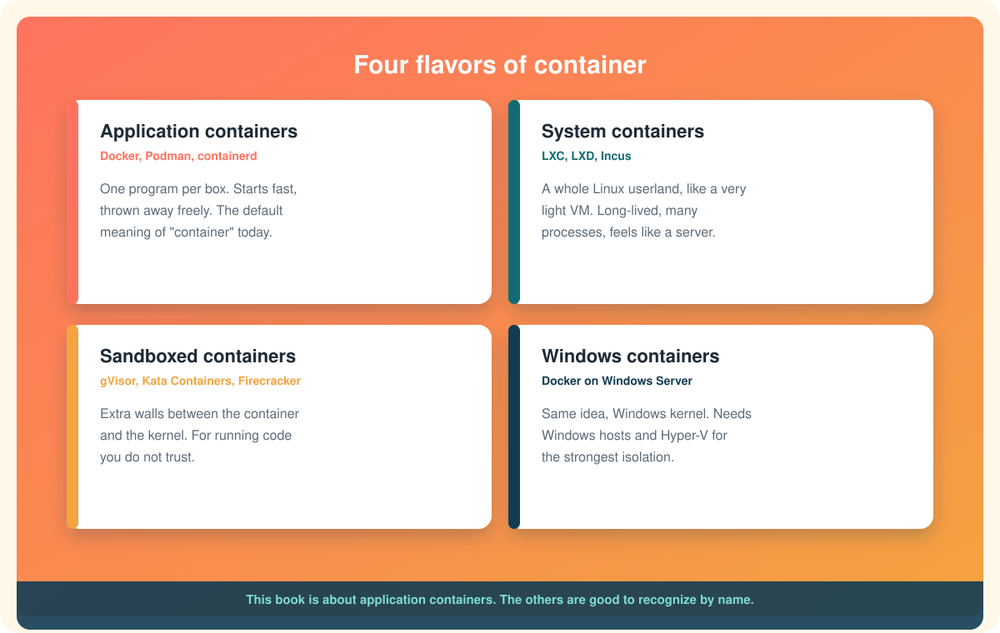

# Types of containers

"Container" is one word doing several jobs. The underlying trick is always the same, a process with a private view and a budget, but people have used that trick for quite different purposes and built quite different tools around it. Knowing the four main families keeps you from being confused when a tutorial says "container" and means something other than Docker.

  

# 1. Application containers

**Examples:** Docker, Podman, containerd, CRI-O.

This is what almost everyone means by "container" today, and it is what this whole book is about.

An application container runs **one program**. Not a whole operating system's worth of services, just one: a web server, a database, a script. When that program exits, the container is finished. The container's filesystem comes from an **image** that packages the program and its libraries, and the image is built from a recipe, usually a Dockerfile.

The design philosophy is "cattle, not pets." You do not log into an application container and fix it. You throw it away and start a fresh one from the image. That is what makes them so good at scaling: a hundred identical copies of a web server, started and stopped as traffic rises and falls.

Application containers follow shared standards from the **Open Container Initiative** (OCI), so an image built by Docker can be run by Podman or containerd, and vice versa.[^oci] Learn one and you have learned the shape of them all.

**Recognize it by:** one process, an image built from a Dockerfile, a short life, a registry like Docker Hub.

# 2. System containers

**Examples:** LXC, LXD, Incus, OpenVZ, Solaris Zones, FreeBSD jails.

System containers are older than Docker, and they take the same kernel features in a different direction. Instead of one program, a system container runs a **whole Linux userland**: an init system, logging, SSH, cron, and whatever services you install, exactly as a freshly installed server would.[^lxc]

From the inside it feels almost exactly like a small VM. You log in, you `apt install` things, you edit config files, you reboot it. It lives for months. The difference from a real VM is that it still shares the host kernel, so it starts in a second and weighs very little.

The philosophy is "pets." A system container is a long-lived machine you tend, just a very cheap one. Hosting providers love them for selling cheap Linux boxes, and developers use them for a disposable "second computer" on their laptop.

**Recognize it by:** a full init process, multiple services, SSH access, a lifespan measured in months, tools called LXC, LXD, or Incus.

# 3. Sandboxed and VM-backed containers

**Examples:** gVisor, Kata Containers, Firecracker microVMs, Nabla.

The [previous page](containers-vs-virtual-machines.md) noted that a container's isolation comes from the kernel, and a kernel bug can let a container escape. For your own code on your own laptop that is fine. For a cloud running code uploaded by strangers, it is not.

Sandboxed containers add a wall. They look like ordinary application containers to Docker or Kubernetes, same images, same commands, but underneath they run each container with an extra layer between it and the real kernel.

* **gVisor** puts a small, purpose-built kernel written in Go between the container and the host. The container talks to gVisor; gVisor decides what, if anything, to pass on to the real kernel.[^gvisor]
* **Kata Containers** go further and run each container inside its own tiny, fast-booting virtual machine with its own kernel. You get VM-grade isolation with a container's workflow.[^kata]
* **Firecracker** is the micro-VM technology from Amazon that makes "a VM per container" fast enough to be practical. It is what runs AWS Lambda functions.

The cost is a little speed and a little compatibility. The gain is that an escape from the container lands you in a throwaway sandbox, not on the host.

**Recognize it by:** words like "sandbox," "microVM," "runtime class," or "runsc," and a context involving untrusted or multi-tenant workloads.

# 4. Windows containers

**Examples:** Docker on Windows Server, with process isolation or Hyper-V isolation.

Everything above assumes Linux, because namespaces and cgroups are Linux features. Windows has its own equivalents, and so Windows has its own containers that run **Windows** programs on a **Windows** kernel.[^win-containers]

They come in two isolation modes. **Process isolation** is the Windows analogue of a Linux container: shared kernel, light, fast. **Hyper-V isolation** runs each container in a small VM, like Kata does on Linux, for a stronger boundary.

Windows containers run only on Windows hosts, and the host's Windows version has to closely match the image's. They are a niche compared to Linux containers, mostly used for moving older .NET Framework applications into modern deployment pipelines. On your laptop, Docker Desktop can switch between Linux containers (the default) and Windows containers, but not run both at once.

**Recognize it by:** base images like `mcr.microsoft.com/windows/servercore`, PowerShell inside the container, and a Windows Server host.

# Which one does Docker make?

Application containers, Linux ones by default. When this book says "container" without qualification, that is what it means. When you see the other three in the wild, you will now know they are cousins with the same grandparents, raised for different jobs.

# One sentence to keep

Same trick, four purposes: one app (Docker), one machine (LXC), one untrusted app (gVisor and Kata), or one Windows app (Windows containers).

Next: [The history and evolution of containers](history-and-evolution-of-containers.md)

[^oci]: Linux Foundation, Open Container Initiative.
[^lxc]: linuxcontainers.org, Linux Containers.
[^gvisor]: Google, gVisor documentation.
[^kata]: OpenInfra Foundation, Kata Containers.
[^win-containers]: Microsoft, Windows and containers.
