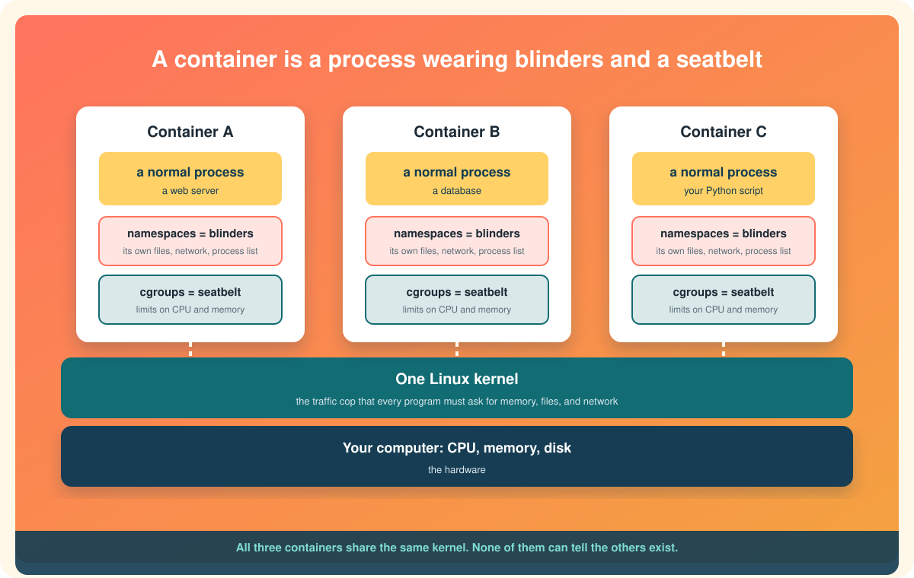

# What is a container?

Here is the short version. **A container is a normal program that has been tricked into thinking it has a computer all to itself.**

It is not a tiny computer. It is not a virtual machine. It is a program, running on your actual machine, using your actual processor and memory, that has been handed a carefully edited view of the world. It sees its own files and nobody else's. It sees its own network. If it lists running programs, it sees only itself and its children. It has a cap on how much memory and processor time it may use. Step outside the container and look at the same machine, and that "whole computer" is just one more process in the list.

Everything else about containers, from Docker to Kubernetes, is built on that one trick. So let us look at how the trick works.

  

# First, three words you need

Containers are a Linux idea, and the explanation uses three Linux words. None of them is hard.

**A process** is a running program. When you open a browser, that is a process. Open a second window and that may be another one. Your computer is running hundreds right now. Each has a number, a list of files it has open, and a share of memory.

**The kernel** is the one program that is in charge of all the others. It is the core of the operating system. When a process wants to read a file, open a network connection, or use more memory, it does not touch the hardware directly. It asks the kernel, and the kernel decides. Think of it as the building superintendent: every process rents a room, and every request for water, power, or keys goes through the super.

**Isolation** just means keeping things apart so they cannot see or interfere with each other. Two tenants in the same building, each with their own locked apartment, are isolated even though they share one roof, one plumbing system, and one superintendent.

Hold onto the building picture. A container is an apartment. The kernel is the super. The hardware is the building.

# The two Linux features that make a container

A container is built from two kernel features that were added to Linux years apart and were never originally meant to go together. Docker's cleverness was in combining them and making them easy.

## Namespaces: the blinders

A **namespace** is a way for the kernel to show a process a private, edited version of one part of the system.[^namespaces-man] Linux has several kinds, one per thing it can edit:

| Namespace | What the process is shown | Everyday version |
|---|---|---|
| Mount | Its own set of folders and files, starting from its own root `/` | Your apartment's rooms, not the whole building's |
| PID | Its own list of processes, where it is process number 1 | You only see people inside your apartment |
| Network | Its own network card, IP address, and ports | Your own mailbox and doorbell |
| UTS | Its own hostname | Your own name on the door |
| IPC | Its own channels for processes to message each other | Your own intercom |
| User | Its own idea of who is "root" and who is a regular user | You are the boss of your apartment, not the building |

When Docker starts a container, it asks the kernel to create a fresh set of these namespaces and put the new process inside all of them. From inside, the process looks around and sees a computer with one process running (itself), one network interface, one filesystem. It cannot see the other containers or the host's processes. It is not that they are hidden behind a password. From inside the namespace they simply do not exist in the list.

That is the "blinders" half.

## Control groups: the seatbelt

Blinders stop a process from *seeing* others. They do not stop it from *hogging*. A runaway program inside a namespace can still eat every byte of memory and starve everything else.

A **control group**, almost always shortened to **cgroup**, is the kernel's way of putting a process (or a group of them) on a budget.[^cgroups-man] This group may use at most 512 MB of memory. This group gets at most half a processor core. This group may write to disk at no more than a certain speed. If the group tries to exceed its memory budget, the kernel kills it rather than let it take the machine down.

That is the "seatbelt" half, and it is why a container that leaks memory crashes itself instead of your laptop.

## Put them together

Namespaces plus cgroups, wrapped around a process, is a container. Really. There is no magic third ingredient. If you were patient and knew the right system calls, you could build one by hand without Docker. People did, for years. It was just miserable, and that is the gap Docker filled.

# Wait, where did the files come from?

Fair question. We said the container sees its own filesystem starting at `/`. Its own copy of `/bin`, `/usr`, `/etc`, all of it. Where did that come from, and does every container copy gigabytes of Linux around?

No. This is where **images** come in.

A **container image** is a frozen, read-only snapshot of a filesystem: every file a program needs to run, including the program itself, its libraries, and usually a slimmed-down set of the standard Linux folders. An image for a Python app contains Python, the app's code, and the handful of system files Python needs. It does not contain a kernel, because the container will use the host's kernel. That is why images can be a few dozen megabytes instead of a few gigabytes.

Images are built in **layers**. Each line of a Dockerfile adds a layer on top of the previous one, and each layer is just "the files that changed." Layers are shared. If ten images all start from the same Ubuntu base layer, that base is stored on your disk once.[^docker-overview]

When you run a container, Docker stacks the image's read-only layers, adds one thin writable layer on top for anything the running program changes, and points the new mount namespace at the result. The program sees a complete filesystem. The disk sees a stack of shared layers and one small scratchpad. Delete the container and only the scratchpad disappears. The image is untouched and ready to be run again.

So, one more time, with everything in place:

> **A container is a process, running on the host's kernel, placed in its own namespaces so it sees only its own world, limited by cgroups so it cannot hog, with its filesystem supplied by a layered, read-only image plus a thin writable layer on top.**

That sentence is dense, but every word in it is now something you have met.

# Why anyone cares

Knowing *what* a container is explains *why* people got so excited about them.

**It starts instantly.** There is no operating system to boot. The kernel is already running. Starting a container is starting a process, which takes milliseconds.

**It is small.** No kernel, no drivers, no desktop, no copies of what the host already has. Just the program and its files.

**It runs the same everywhere.** The image carries every file the program depends on. If it ran on your laptop, it will run on your colleague's laptop and on the server, because they are all running the *same files* on *a* Linux kernel. "Works on my machine" stops being an excuse because your machine is now shippable.

**It is disposable.** Containers are cheap to create and cheap to throw away, so you stop nursing them and start replacing them. That mindset change is most of what "DevOps" turned out to mean in practice.

# What a container is not

A few ideas to let go of, if you have them:

* **It is not a lightweight VM.** It shares the host kernel. There is no second operating system inside. The next page, [Containers vs virtual machines](containers-vs-virtual-machines.md), is all about this.
* **It is not a security boundary you should bet your life on.** Namespaces are good isolation, but a kernel bug can let a container escape. For untrusted code, people add stronger walls. See [Types of containers](types-of-containers.md).
* **It is not Docker.** Docker is one tool that creates containers. Containers are the Linux feature. Podman, containerd, LXC, and others create them too. Understanding this is what lets you read any container tool's documentation without panic.

# One sentence to keep

A container is a process with blinders and a seatbelt, standing on a stack of frozen files.

Next: [Containers vs virtual machines](containers-vs-virtual-machines.md)

[^namespaces-man]: Linux man-pages project, namespaces(7).
[^cgroups-man]: Linux man-pages project, cgroups(7).
[^docker-overview]: Docker Inc., What is Docker?
