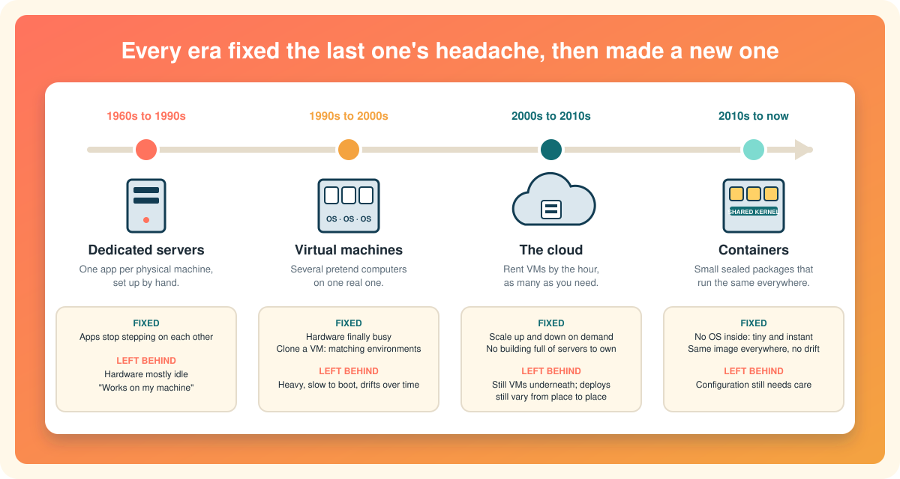
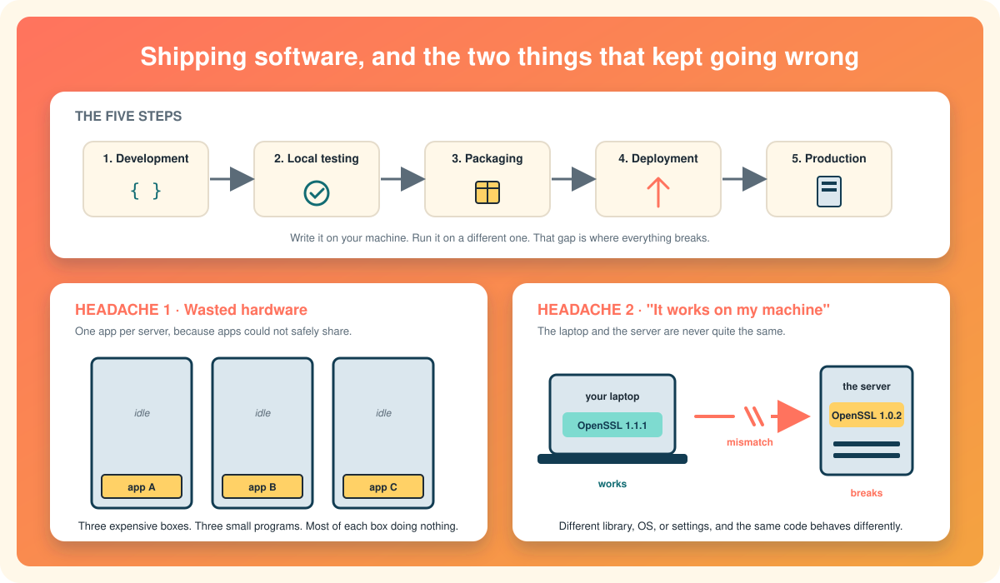

# Why containers exist: the evolution of software deployment

Here is the short version. **Every generation of software deployment fixed the previous generation's biggest headache, and then handed the next generation a new one.** Containers are simply the latest fix. Once you know which headaches they were built to cure, every Docker feature you meet later will make sense.

So before we open Docker, let us step back and walk through the four eras of getting software from a programmer's laptop onto a server that other people can use.

  

# The four eras in one breath

| Era | Roughly when | The big idea | The headache it left behind |
|---|---|---|---|
| **Dedicated servers** | 1960s to 1990s | One physical machine per application, set up by hand | Wasted hardware, and settings that never matched between machines |
| **Virtual machines** | 1990s to 2000s | Carve one physical server into several pretend computers | Each pretend computer is heavy, slow to boot, and fiddly to manage |
| **The cloud** | 2000s to 2010s | Rent those pretend computers by the hour, as many as you need | Still the same heavy machines underneath, and deployments still varied from place to place |
| **Containers** | 2010s to now | Ship a small, sealed package that runs identically everywhere | Fewer headaches, but configuration still needs care |

Each row is a real answer to the row above it. Let us see the problems up close, because the problems are the whole point.

# How software gets shipped, in five steps

Imagine you are the programmer. Simplifying a lot, your work moves through five stages:

1. **Development.** You write the code on your own machine.
2. **Local testing.** You run it there and check that it does what you meant.
3. **Packaging.** Once you are happy, you bundle it up: the code plus whatever it needs to run.
4. **Deployment.** You copy that bundle onto a different machine, a **server**, which is just a computer whose job is to run software for other people.
5. **Production.** The server runs your software for real users. People in this line of work call that server, and that state of being live, "production".

That is the whole loop. Real companies add many more steps, but every one of them hangs off this skeleton. Now rewind to the first era and watch what goes wrong.

  

# Era one: dedicated servers, and two headaches

In the dedicated-server era, each application got its own physical machine. Not because anyone liked buying machines, but because it was genuinely hard to make two applications share one safely. One program might grab a network port the other needed, or eat the memory the other was counting on. Programs on the same machine could and did interfere with each other, so the safe rule became **one application, one server**.

That rule caused two problems that every later era has been trying to solve.

## Headache 1: wasted hardware

Nobody could predict exactly how much processor and memory an application would need. So the IT department bought the biggest, fastest server they could afford, and then ran a single program on it, which typically used a sliver of what the box could do. Need to run a second application? Buy a second server. Every new program meant more money, more electricity, more space, and more things to look after. Most of that expensive hardware sat idle most of the time.

## Headache 2: "it works on my machine"

The second problem is subtler, and if you have ever written code you may have felt it.

When you build and test software on your own computer, it runs inside a particular **environment**: a particular operating system, particular versions of the libraries your code calls, particular settings and network details. Your program works perfectly there. Then you copy it to the production server and it falls over.

Why? Because the server is a *different* environment. Something, somewhere, does not match:

* **Different software versions.** Suppose your program uses OpenSSL, a common library for encryption. On your machine it is version 1.1.1. On the server it is version 1.0.2. The two behave slightly differently, and your program hits a bug that never appeared at home.
* **A different operating system,** or a different release of the same one.
* **Different network settings,** different environment variables, different file paths.

Tracking down which of the dozens of moving parts is the culprit was slow and painful, and it happened on every deployment. Programmers shrugged and said *"well, it works on my machine,"* which became the most famous excuse in software. The honest root cause was that nobody could make the laptop and the server truly identical.

So, to sum up the first era: **one app per server wasted hardware, and no two machines were ever quite the same.**

# Era two: virtual machines fix both

A **virtual machine** (VM) is a pretend computer running inside a real one.[^vmware-vm] Special software splits one physical server into several imaginary ones, and each imaginary computer gets its own complete operating system, its own applications, and its own libraries, as if it were a separate box. From the inside it looks and behaves almost exactly like a real computer. (The [next-but-one page](containers-vs-virtual-machines.md) goes deeper on how.)

Watch how neatly that cures both headaches.

| Headache | How a VM fixes it |
|---|---|
| **Wasted hardware** | Run several VMs on one physical server. Each application still gets its own "machine", but now five or ten of those machines share one box. The hardware that used to sit idle is finally busy, and you buy far fewer servers. |
| **"Works on my machine"** | A VM is just a big file, so it can be **cloned**. Build your environment once, test your software in it, then copy the identical VM to the production server. Same operating system, same library versions, same settings, on both sides. If it ran in the clone at home, it runs in the clone on the server. |

This was an enormous step forward. Companies like VMware built the era on it, and deployment went from a gamble to something repeatable.

## The new headaches

As always, the fix came with its own bill.

* **VMs are heavy.** Every VM carries a whole operating system, and every operating system needs its own slice of processor, memory, and disk just to exist. Ten VMs means ten copies of an operating system doing the same housekeeping ten times over. That is better than ten physical servers, but it is nowhere near free.
* **VMs are slow to start.** Starting a VM means booting an operating system, exactly like switching on a laptop. Seconds at best, often minutes. Fine for a server you start once a year. Painful if you want to spin something up, use it for a moment, and throw it away.
* **VMs drift.** Cloning gave you identical machines *on day one*. Then developers install a new library on the local VM. An operating-system update lands on the server VM but not the other. Six months later the "identical" machines quietly disagree again, and "works on my machine" creeps back. This slow divergence has a name: **configuration drift**.
* **VMs are fiddly.** Managing a fleet of full operating systems, each needing patches and care, is real work.

# Era three: the cloud makes VMs rentable

The cloud did not replace virtual machines. It rented them out.[^nist-cloud] Instead of buying a server and carving it into VMs yourself, you ask a provider for a VM and get one in minutes, pay only while it runs, and ask for a hundred more when traffic spikes. Resources follow demand, which pushes hardware efficiency even higher, and nobody has to own a building full of machines.

But look underneath and it is the same technology as era two. The machines you rent are still VMs, with the same weight, the same boot time, and the same drift. And because every provider configures things a little differently, moving software between your laptop, one cloud, and another cloud brought back the old inconsistency problem in a new coat. The cloud solved *where the servers live*. It did not solve *what you put on them*.

# Era four: containers

A **container** is a small, sealed package that holds a program together with everything that program needs to run: its libraries, its settings, its dependencies.[^docker-what-is-a-container] Crucially, it does **not** hold an operating system. Instead, all the containers on a machine share the one operating system that is already running there.

That one difference is the whole trick, so it is worth a plain-words detour. Every operating system has a core part that is always loaded and always running, the bit that talks to the hardware and hands out memory and processor time to programs. That core is called the **kernel**. A VM brings its own kernel. A container borrows the host's. (The [next page](what-is-a-container.md) explains exactly how that borrowing works.)

Now compare the two side by side.

| What you care about | Virtual machine | Container |
|---|---|---|
| **Hardware efficiency** | Heavy. Each one carries a full operating system that needs its own processor, memory, and disk. | Light. Shares the host's kernel and carries only the application and its files. |
| **Speed and scale** | Slow. Starting one means booting an operating system. | Instant. Starting one is starting a program. Launch ten, or a thousand, in moments. |
| **Consistency between environments** | Decent on day one, then configuration drift sets in. | Very high. The whole runtime, library versions and all, is frozen into one image, and that identical image runs on the laptop, the test machine, and the server. |

That third row is the one to remember. Instead of cloning a whole machine and hoping it stays in sync, you build one **container image**, a frozen snapshot of the program and its environment, and run *that exact same image* everywhere. There is nothing to drift, because nothing on the server was set up by hand. And because an image is so much smaller than a VM, copying it around is quick and cheap, so people actually do it.

Containers do not make every problem vanish. You still have to decide what goes in the image, and configuration still needs thought. But the two headaches that have haunted deployment since the 1960s, idle hardware and mismatched machines, are the two things containers are best at.

# The story, in four lines

* **Dedicated servers:** one app per machine. Wasted hardware; no two machines alike.
* **Virtual machines:** many pretend computers per machine. Better use of hardware; cloning gives matching environments. But each one is a full operating system: heavy, slow to boot, and prone to drift.
* **The cloud:** rent those VMs on demand. Great scalability, less hardware to own. The VM headaches come along for the ride.
* **Containers:** no operating system inside, just the app and its needs, sharing the host's kernel. Tiny, instant, easy to clone and scale, and the same image everywhere, so environments stop drifting.

# One sentence to keep

Containers exist because for fifty years the hard part of shipping software was never writing it; it was making the machine it runs on match the machine it was written on.

Next: [What is a container?](what-is-a-container.md)

[^docker-what-is-a-container]: Docker Inc., What is a container?
[^vmware-vm]: Broadcom (VMware), What is a virtual machine?
[^nist-cloud]: NIST, The NIST Definition of Cloud Computing, SP 800-145.
